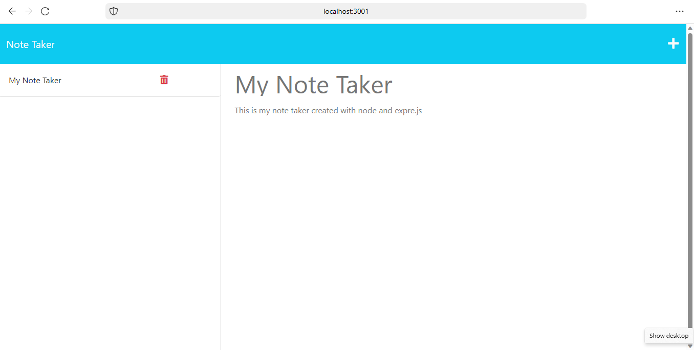

# 11 Express.js: Note Taker

## Your Task:

Your assignment is to modify starter code to create an application called Note Taker that can be used to write and save notes. This application will use an Express.js back end and will save and retrieve note data from a JSON file.

The application’s front end has already been created. It's your job to build the back end, connect the two, and then deploy the entire application to Heroku.


## User Story:

```
AS A small business owner
I WANT to be able to write and save notes
SO THAT I can organize my thoughts and keep track of tasks I need to complete
```


## Acceptance Criteria:

```
GIVEN a note-taking application
WHEN I open the Note Taker
THEN I am presented with a landing page with a link to a notes page
WHEN I click on the link to the notes page
THEN I am presented with a page with existing notes listed in the left-hand column, plus empty fields to enter a new note title and the note’s text in the right-hand column
WHEN I enter a new note title and the note’s text
THEN a Save icon appears in the navigation at the top of the page
WHEN I click on the Save icon
THEN the new note I have entered is saved and appears in the left-hand column with the other existing notes
WHEN I click on an existing note in the list in the left-hand column
THEN that note appears in the right-hand column
WHEN I click on the Write icon in the navigation at the top of the page
THEN I am presented with empty fields to enter a new note title and the note’s text in the right-hand column
```

## Mock-Up

The following animation demonstrates the application functionality:


## Motivation

I was motivated to do this project to learn how to use Express.js to create a server and how to use the fs module to read and write to a JSON file. I also wanted to learn how to deploy an application to Heroku. Upon troubleshooting heroku with George, Dan, and Kirkley I was advised to deploy to render instead of heroku due to some serious technical difficulties.

## Why

I created this project because I wanted to learn how to use Express.js to create a server and how to use the fs module to read and write to a JSON file. I also wanted to learn how to deploy an application to Heroku.

## What problem does it solve

This note taking application solves the problem of not being able to take notes and save them to a JSON file.

## What did you learn

I learned how to create CRUD routes on Express.js and how to read and write a file using the fs module.

## What makes your project stand out

This project stands out because it is a simple application that can be used to take notes and save them to a JSON file. It also has the ability to delete notes.

## Instructions

First, clone the repository to your local machine, git init, git add, git commit -m "message", git push origin main. Then, install the necessary dependencies by running npm install. Next, run node server.js to start the server. Finally, open your browser and navigate to localhost:3001 to view the application.

## Bonus

I added functionality to DELETE notes. This was done by adding the following API route:

* `DELETE /api/notes/:id` receives a query parameter that contains the id of a note to delete. To delete a note the code reads all notes from the `db.json` file, removes the note with the given `id` property, and then rewrites the notes to the `db.json` file.

### Link to github repository

[Git Hub Repo](https://github.com/precisecoding/Note-Taker.git)

### Link to deployed application on Heroku (Render)

Render Deployment Link:

https://note-taker-h9rt.onrender.com/

### License

MIT License:
[OpenSource.org](https://opensource.org/licenses/MIT)
[License Chosen from](https://choosealicense.com/licenses/mit/)
LICENSE file included in repository.

### Thanks to everyone for support and contributions

[Sources used:] (https://developer.mozilla.org/en-US/), (https://www.w3schools.com/), (https://stackoverflow.com/).
Worked with TA George Yoo while on writing the pseudo code, once again he was very helpful.
